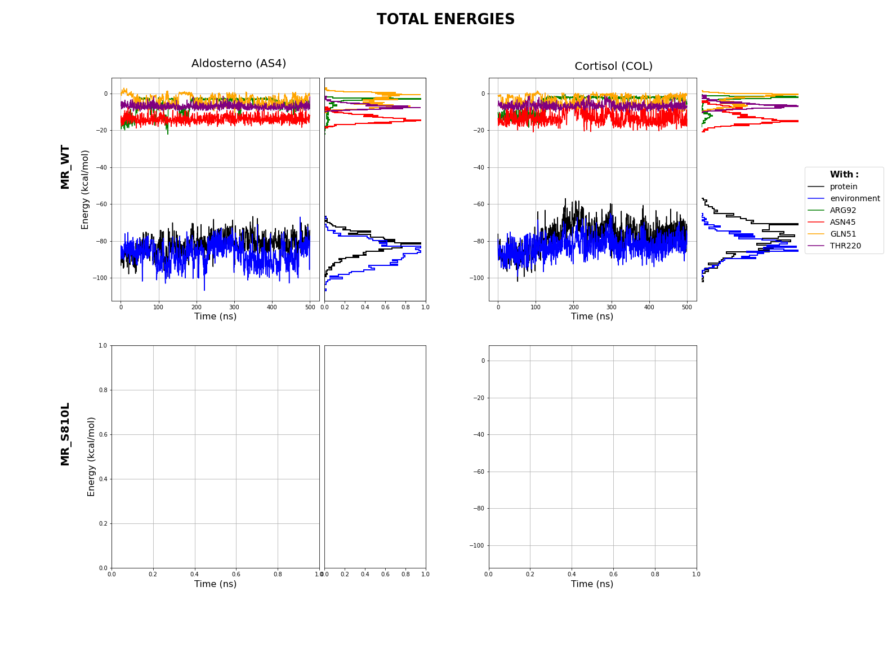

# Molecular Dynamics - Sao Carlos Physics Institute (MD-SCPI)

Evaluation of the unbinding kinetics of Mineralocorticoid (MR) receptor steroid agonist Cortisol (COL) and Aldosterone (AS4) ligands.

## Objectives

- Prepare the input files: PDB and mol files of the Mineralocorticoid (MR) and mutation ligands and proteins Aldosterone and Cortisol (AS4 and COL)
- Create a Molecular Dynamics (MD) simulation for the MR/MR_mut - aldosterone/cortisol system
- Create a Monte Carlo (MC) simulation for the MR aldosterone/cortisol system
- Contrast MD and MC simulations, does the MC simulation show the same behavior as MC?

## Links of interest:

- [PDB-rcsb](https://www.rcsb.org/)
- [GaMD](http://miaolab.org/GaMD/)
- [GamD in openMM](https://github.com/ljmartin/openmm_gamd)
- [GamD](https://github.com/MiaoLab20/GaMD-OpenMM)
- [OpenMM](https://github.com/openmm/openmm)
- [LiBELa](https://github.com/alessandronascimento/LiBELa)
- [Amber Manuals](http://ambermd.org/doc12/Amber22.pdf)
- [Chimera User Guide - commands](https://www.cgl.ucsf.edu/chimera/docs/UsersGuide/framecommand.html)

## [Weekly Reports](https://saguileran.github.io/MD-SCPI/Reports/)

Report of weekly updates. 

## Output Files

<h3 align="center" margin-bottom=0>MR-AS4</h3>

  

    <video id="video" width="500" height="500" controls>
        <source src="./Results/MR-AS4.mp4" type="video/mp4">
    </video>
  

    

        
Mineralocorticoid (MR) protein interaction with aldosteron (AS4) ligand

    

<h3 align="center" margin-bottom="-10">MR-COL</h3>

  

    <video id="video" width="500" height="500" controls>
        <source src="./Results/MR-COL.mp4" type="video/mp4">
    </video>
  

    

        
Mineralocorticoid (MR) protein interaction with cortisol (COL) ligand

    

<h3 align="center" margin-bottom="-10">Energies</h3>

This image is obtained using the [PlotEnergies.ipynb](./NoteBooks/PlotEnergies.ipynb) notebook that use jscatter pacakge to import dat files and matplotlib to plot.

## References

### Proteins and Ligands

[1] [Mechanistic aspects of mineralocorticoid receptor activation](https://reader.elsevier.com/reader/sd/pii/S0085253815468644?token=DD3F83E8E16FA5690227FDF101F9E90AE9B71E9354A0C682904FE8E2C2A683B22EB819B6DF7372B86DDB5F00FBB62164&originRegion=us-east-1&originCreation=20230228185341)

[2] [The Severe Form of Hypertension Caused by the Activating S810L Mutation in the Mineralocorticoid Receptor Is Cortisone Related](https://pubmed.ncbi.nlm.nih.gov/12538613/)

[3] [Activating Mineralocorticoid Receptor Mutation in Hypertension Exacerbated by Pregnancy](https://www.science.org/doi/epdf/10.1126/science.289.5476.119)

[4] [Crystal structure of a mutant mineralocorticoid receptor responsible for hypertension](https://www.nature.com/articles/nsmb939)

[5] [Activating MineralocorticoidReceptor Mutation inHypertension Exacerbated byPregnancy](https://www.science.org/doi/epdf/10.1126/science.289.5476.119)

### Software

[6] [Comparative Analysis of Electrostatic Models for Ligand Docking](https://www.frontiersin.org/articles/10.3389/fmolb.2019.00052/full)

[7] [Ligand Gaussian accelerated molecular dynamics (LiGaMD):
Characterization of ligand binding thermodynamics and kinetics](https://www.biorxiv.org/content/10.1101/2020.04.20.051979v1.full.pdf)

[8] [Ligand Gaussian Accelerated Molecular Dynamics (LiGaMD):
Characterization of Ligand Binding Thermodynamics and Kinetics - latest](https://pubs.acs.org/doi/pdf/10.1021/acs.jctc.0c00395)

[9] [Gaussian accelerated molecular dynamics: principles and applications](http://miaolab.org/library/documents/2021-WIREs_GaMD.pdf)

[10] [Ligand- and receptor-based docking with LiBELa](https://pubmed.ncbi.nlm.nih.gov/26141308/)

[11] [MolShaCS: A free and open source tool for ligand similarity identification based
on Gaussian descriptors](https://reader.elsevier.com/reader/sd/pii/S0223523412006824?token=505CA34938BA9801282431D305185F62931911820538A228E6B97282A877D9F8E0EDF1194E046E02FB60090D0D93B694&originRegion=us-east-1&originCreation=20230224192727)

[12] [Gaussian Accelerated Molecular Dynamics in OpenMM](https://pubs.acs.org/doi/pdf/10.1021/acs.jpcb.2c03765)

[13] [Towards a critical evaluation of an empirical and volume-based solvation function for ligand docking](https://journals.plos.org/plosone/article?id=10.1371/journal.pone.0174336)

[14] [Making-it-rain: Cloud-based molecular simulations for everyone](https://zenodo.org/record/5196783#.Y_z-0rTMK3w)
