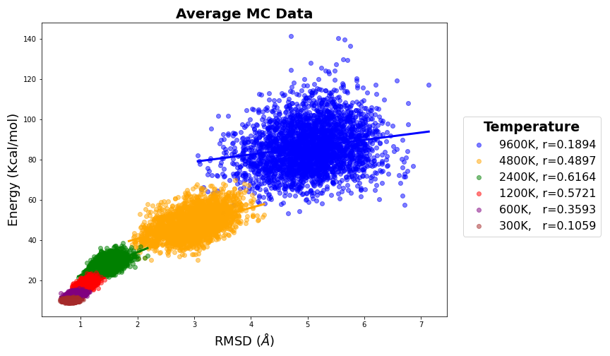
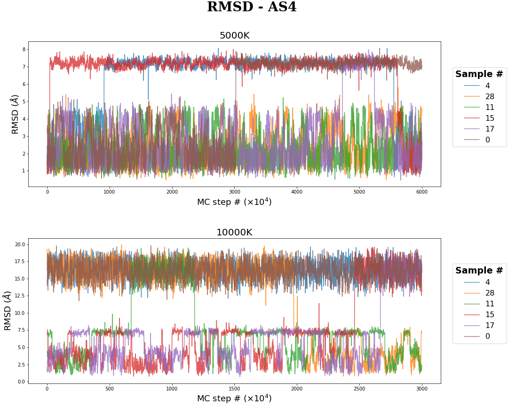

# Molecular Modeling and Simulation - Physics Institute of São Carlos (IPSC)

# Table of Contents

- [Overview](#overview)
- [Objectives](#objectives)
- [Links of Interest](#links-of-interest)
- [Reports](#reports)
    - [Weekly Reports](#weekly-reports)
    - [Final Report](#final-report)
- [Output Files](#output-files)
- [References](#references)
    - [Proteins and Ligands](#proteins-and-ligands)
    - [Software](#software)
    - [Theory](#theory)

## Overview

Study and evaluation of the unbinding kinetics of Mineralocorticoid (MR and MR-S810L) receptor steroid agonist Cortisol (COL), Aldosterone (AS4), and Progesterone (STR) ligands using Molecular Dynamics (MD) and Monte Carlo (MC) simulations, LiGaMD and LiBELa softwares respectively.

## Objectives

- Prepare the input files: PDB and mol files of the Mineralocorticoid (MR) and MR mutation (S810L) ligands and the Aldosterone (AS4), Cortisol (COL), and Progestero (STR) proteins
- Create the Molecular Dynamics (MD) simulations for the MR/MR_mut - aldosterone/cortisol/progesteron system
- Create the Monte Carlo (MC) simulations for the MR aldosterone/cortisol/prgesteron systems
- Contrast MD and MC simulations, does the MC simulation show the same behavior as MC?

## Links of Interest

- [PDB-rcsb](https://www.rcsb.org/)
- [GaMD](http://miaolab.org/GaMD/)
- [GamD in openMM](https://github.com/ljmartin/openmm_gamd)
- [GamD](https://github.com/MiaoLab20/GaMD-OpenMM)
- [OpenMM](https://github.com/openmm/openmm)
- [LiBELa](https://github.com/alessandronascimento/LiBELa)
- [Amber Manuals](http://ambermd.org/doc12/Amber22.pdf)
- [Chimera User Guide - commands](https://www.cgl.ucsf.edu/chimera/docs/UsersGuide/framecommand.html)
- [Living Journal of Computational Molecular Science](https://livecomsjournal.org/index.php/livecoms/index)
- [tese_Alessandro_Silva_Nascimento.pdf](https://teses.usp.br/teses/disponiveis/76/76132/tde-13032009-124546/publico/tese_Alessandro_Silva_Nascimento.pdf) pag ~127
- [Highly accurate protein structure prediction with AlphaFold](https://www.nature.com/articles/s41586-021-03819-2)
- [Aldosterone and mineralocorticoid receptors: Orphan questions](https://www.sciencedirect.com/science/article/pii/S0085253815468814)

## [Reports](https://saguileran.github.io/MD-SCPI/reports/)

Reports made during the internship. Here you can find weekly updates and the final report with some conclusions.

### [Weekly Reports](https://github.com/saguileran/MD-SCPI/tree/main/Reports)

### [Final Report](https://github.com/saguileran/MD-SCPI/blob/main/Reports/FinalReport.pdf)

## Output Files

<h3 align="center" margin-bottom=0>MR-AS4 MD simulation</h3>

  

    <video id="video" width="500" height="500" controls>
        <source src="./Results/MR-AS4.mp4" type="video/mp4">
    </video>
  

    

        
Mineralocorticoid (MR) protein interaction with aldosteron (AS4) ligand

    

<h3 align="center" margin-bottom="-10">MR-COL MD simulation</h3>

  

    <video id="video" width="500" height="500" controls>
        <source src="./Results/MR-COL.mp4" type="video/mp4">
    </video>
  

    

        
Mineralocorticoid (MR) protein interaction with cortisol (COL) ligand

    

<h3 align="center" margin-bottom="-10">MD Energies</h3>

This image is obtained using the [PlotEnergies.ipynb](./NoteBooks/PlotEnergies.ipynb) notebook that use jscatter pacakge to import dat files and matplotlib to plot.

<h3 align="center" margin-bottom="-10">MC Energies</h3>

<h3 align="center" margin-bottom="-10">MC RMSD</h3>

These image are obtained using the [Plots_MC.ipynb](./NoteBooks/Plots_MC.ipynb) notebook that use jscatter pacakge to import dat files and matplotlib to plot.

## References

### Proteins and Ligands

[1] Chantal Hellal-Levy, Jérôme Fagart, Anny Souque, and Marie-Edith Rafestin-Oblin. [Mechanistic aspects of mineralocorticoid receptor activation](https://www.sciencedirect.com/science/article/pii/S0085253815468644). *Kidney International*, 57(4):1250–1255, 2000.

[2] Marie-Edith Rafestin-Oblin, Anny Souque, Brigitte Bocchi, Gregory Pinon, Jerome Fagart, and Alain Vandewalle. [The Severe Form of Hypertension Caused by the Activating S810L Mutation in the Mineralocorticoid Receptor Is Cortisone related](https://pubmed.ncbi.nlm.nih.gov/12538613/). *Endocrinology*, 144(2):528–533, 02 2003.

[3] David S. Geller, Anita Farhi, Nikki Pinkerton, Michael Fradley, Michael Moritz, Adrian Spitzer, Gretchen Meinke, Francis T. F. Tsai, Paul B. Sigler, and Richard P. Lifton. [Activating mineralocorticoid receptor mutation in hypertension exacerbated by pregnancy](https://www.science.org/doi/epdf/10.1126/science.289.5476.119). *Science*, 289(5476):119–123, 2000.

[4] Jérôme Fagart, Jessica Huyet, Grégory M. Pinon, Marina Rochel, Claudine Mayer, and Marie-Edith Rafestin-Oblin. [Crystal structure of a mutant mineralocorticoid receptor responsible for hypertension](https://www.science.org/doi/epdf/10.1126/science.289.5476.119). *Nature Structural & Molecular Biology*, 12(6):554–555, Jun 2005.

### Software

[5] K. Belfon I.Y. Ben-Shalom J.T. Berryman S.R. Brozell D.S. Cerutti T.E. Cheatham III G.A. Cisneros V.W.D. Cruzeiro T.A. Darden R.E. Duke G. Giambasu M.K. Gilson H. Gohlke A.W. Goetz R. Harris S. Izadi S.A. Izmailov K. Kasavajhala M.C. Kaymak E. King A. Ko-valenko T. Kurtzman T.S. Lee S. LeGrand P. Li C. Lin J. Liu T. Luchko R. Luo M. Machado V. Man M. Manathunga K.M. Merz Y. Miao O. Mikhailovskii G. Monard H. Nguyen K.A. O’Hearn A. Onufriev F. Pan S. Pantano R. Qi A. Rahnamoun D.R. Roe A. Roitberg C. Sagui S. Schott-Verdugo A. Shajan J. Shen C.L. Simmerling N.R. Skrynnikov J. Smith J. Swails R.C. Walker J. Wang J. Wang H. Wei R.M. Wolf X. Wu Y. Xiong Y. Xue D.M. York S. Zhao D.A. Case, H.M. Aktulga and P.A. Kollman (2022). [Amber 2022](http://ambermd.org/doc12/Amber22.pdf). University of California, San Francisco.

[6] Jinan Wang and Yinglong Miao. [Ligand gaussian accelerated molecular dynamics 2 (ligamd2): Improved calculations of ligand binding thermodynamics and kinetics with closed protein pocket](https://pubs.acs.org/doi/10.1021/acs.jctc.0c00395). *Journal of Chemical Theory and Computation*, 19(3):733–745, 2023. PMID: 36706316.

[7] Yinglong Miao, Apurba Bhattarai, and Jinan Wang. [Ligand gaussian accelerated molecular dynamics (ligamd): Characterization of ligand binding thermodynamics and kinetics](https://pubs.acs.org/doi/pdf/10.1021/acs.jctc.0c00395). *Journal of Chemical Theory and Computation*, 16(9):5526–5547, 2020. PMID: 32692556.

[8] Yinglong Miao, Apurba Bhattarai, and Jinan Wang. [Ligand gaussian accelerated molecular dynamics (ligamd): Characterization of ligand binding thermodynamics and kinetics](https://www.biorxiv.org/content/10.1101/2020.04.20.051979v1.full.pdf). *bioRxiv*, 2020.

[9] Heloisa dos Santos Muniz and Alessandro S. Nascimento. [Ligand- and receptor-based docking with LiBELa](https://pubmed.ncbi.nlm.nih.gov/26141308/). *Journal of Computer-Aided Molecular Design*, 29(8):713–723, Aug 2015.

[10] Pablo R. Arantes, Marcelo D. Polêto, Conrado Pedebos, and Rodrigo Ligabue-Braun. [Making-it-rain: Cloud-based molecular simulations for everyone](https://zenodo.org/record/5196783#.ZBBO7rTMIzN), August 2021.

[11] Matthew M. Copeland, Hung N. Do, Lane Votapka, Keya Joshi, Jinan Wang, Rommie E. Amaro, and Yinglong Miao. [Gaussian Accelerated Molecular Dynamics in OpenMM](https://pubs.acs.org/doi/10.1021/acs.jpcb.2c03765?goto=articleMetrics&ref=pdf). *The Journal of Physical Chemistry B*, 126(31):5810–5820, 2022. PMID: 35895977.

[12] Jinan Wang, Pablo R. Arantes, Apurba Bhattarai, Rohaine V. Hsu, Shristi Pawnikar, Yu-ming M. Huang, Giulia Palermo, and Yinglong Miao. [Gaussian accelerated molecular dynamics: Principles and applications](http://miaolab.org/library/documents/2021-WIREs_GaMD.pdf). *WIREs Computational Molecular Science*, 11(5):e1521, 2021.

[13] Geraldo Rodrigues Sartori and Alessandro S. Nascimento. [Comparative Analysis of Electrostatic Models for Ligand Docking](https://www.frontiersin.org/articles/10.3389/fmolb.2019.00052/full). *Frontiers in Molecular Biosciences*, 6, 2019.

[14] Heloisa S. Muniz and Alessandro S. Nascimento. [Towards a critical evaluation of an empirical and volume-based solvation function for ligand docking](https://journals.plos.org/plosone/article?id=10.1371/journal.pone.0174336). *PLOS ONE*, 12(3):1–19, 03 2017.

### Theory

[15] Tamar Schlick. Molecular Modeling and Simulation: An Interdisciplinary Guide, volume 21 of Interdis- ciplinary Applied Mathematics. *Springer New York, NY*, Berlin, Heidelberg, 2 edition, August 2010.

[16] A.R. Leach. Molecular Modelling: Principles and Applications. *Prentice Hall*, 2 edition, 2001.
